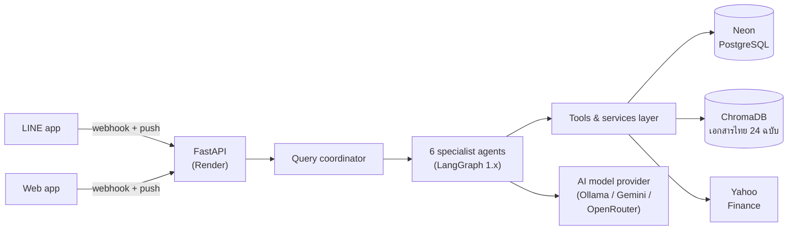

# Personal Finance AI

> ระบบ AI แบบ Multi-Agent สำหรับช่วยจัดการการเงินส่วนบุคคล ออกแบบมาเพื่อผู้ใช้ชาวไทย

[English version](./README_EN.md) | ไทย (เอกสารนี้)

[](./.github/workflows/ci.yml)
[](https://www.python.org/downloads/)


[](./LICENSE)

## สรุปในหน้าเดียว

| | |
|---|---|
| **สถาปัตยกรรม** | LangGraph multi-agent: Router + 6 specialist agents แบบ Hub-and-Spoke (พิสูจน์ด้วย benchmark เทียบกับ P2P/Hierarchical) |
| **RAG** | ChromaDB กับเอกสารการเงินภาษาไทย 24 ฉบับ (PDF จากหน่วยงานจริง สรรพากร/กลต./ตลท.) Recall@3 0.897 |
| **คุณภาพที่วัดได้** | Router accuracy 0.943 บทสนทนาเดี่ยว / 1.000 หลายรอบ · คำนวณภาษีแม่นยำ 95% (MAE 3,000 บาท) · hallucination 0 ในคำตอบหลัก (10/10) |
| **ฝั่ง Engineering** | tests 1,901 ตัว, coverage 92.7%, mypy strict, pylint 10/10, เขียนด้วย TDD ทั้งโปรเจกต์ |
| **Deployment** | FastAPI (REST 14 endpoints) บน Render + Neon Postgres, LINE chatbot, OCR ใบเสร็จ |
| **การประเมินผล** | สร้าง evaluation framework 6 มิติขึ้นเอง: routing ablation (810 LLM calls), ความถูกต้องของคำตอบ, คุณภาพ retrieval, ตรวจ hallucination, benchmark สถาปัตยกรรม |

## โปรเจกต์นี้คืออะไร

ผู้ช่วยการเงินที่คุยด้วยได้เป็นภาษาไทย ทำสิ่งเหล่านี้ได้:

- คำนวณภาษีเงินได้บุคคลธรรมดาของไทย ครบทุกค่าลดหย่อน
- บันทึกและจัดหมวดหมู่รายจ่าย สรุปยอดรายเดือน
- ดูราคาหุ้น อ่านข่าวการเงิน และจัดการ watchlist
- ตั้งเป้าหมายการเงินและคำนวณแผนเก็บเงิน
- แนะนำสิ่งที่ควรทำต่อไป พร้อมคะแนนสุขภาพทางการเงิน
- รวมทุกอย่างเป็นรายงาน (ส่งออก PDF/CSV)

## ความสามารถหลัก

### ระบบ Multi-agent (LangGraph)

LangGraph graph ประกอบด้วย router และ specialist agents 6 ตัว:

- **Router Agent** - จำแนก intent แล้วส่งต่อให้ specialist ที่ถูกต้อง
- **Tax Agent** - ภาษีเงินได้บุคคลธรรมดาของไทย ครบทุกค่าลดหย่อน
- **Expense Agent** - บันทึกรายรับ/รายจ่าย สรุปรายเดือน ค้นตามหมวดหมู่
- **Asset Monitoring Agent** - ราคาหุ้น ข่าวการเงิน watchlist
- **Planning Agent** - เป้าหมายการเงิน แผนเก็บเงิน ตรวจจับสัญญาณทางจิตวิทยา
- **Recommendation Agent** - คำแนะนำเชิงรุกและคะแนนสุขภาพทางการเงิน
- **Report Agent** - รายงานรวมทุกอย่าง ส่งออก PDF/CSV

### คลังความรู้ RAG
Vector store ด้วย ChromaDB และเอกสารการเงินภาษาไทย 24 ฉบับ (Markdown 18 + PDF ทางการ 6) ครอบคลุม:
- ภาษีเงินได้ ค่าลดหย่อน คู่มือยื่นภาษี ภาษีมูลค่าเพิ่ม/ภาษีหัก ณ ที่จ่าย
- หุ้นไทย กองทุนรวม ETF พันธบัตร กลยุทธ์ DCA
- การจัดงบประมาณ เงินสำรองฉุกเฉิน การจัดการหนี้
- ประกันชีวิต/ประกันสุขภาพ ประกันสังคม
- เกษียณและการวางแผนการเงิน
- สินทรัพย์ดิจิทัลและ crypto (อ้างอิงแหล่งข้อมูลจาก ก.ล.ต. และตลท.)

### OCR ใบเสร็จ
อัปโหลดรูปใบเสร็จ ระบบจะดึงรายการ จำนวนเงิน และร้านค้าออกมาเอง
แล้วร่าง transaction เป็น draft ให้กดยืนยันครั้งเดียวจบ
(`POST /ocr/receipt` → `POST /ocr/confirm`) ตัว Vision model ตั้งค่าแยกจาก
chat agent ได้ (`OCR_PROVIDER` + `OCR_MODEL`)

### LINE Chatbot
คุยกับระบบ multi-agent ชุดเดียวกันผ่านแอป LINE:
- `POST /line/webhook` ตรวจ `X-Line-Signature` (HMAC-SHA256) และตอบรับภายในกรอบเวลา ~1 วินาทีของ LINE
- Agent ทำงานเป็น background task แล้วส่งคำตอบภาษาไทยกลับผ่าน Push Message API (reply token หมดอายุก่อน agent ทำงานเสร็จ)
- แต่ละบัญชี LINE map อัตโนมัติกับ user + conversation (`line_user_mappings`) ทำให้ประวัติแชตไม่หาย
- ผูกบัญชี: พิมพ์ `เชื่อมต่อ <userId>` ใน LINE (คัดลอกคำสั่งได้จากการ์ดในเว็บ) เพื่อเชื่อมแชตกับบัญชีเว็บ; พิมพ์ `ยกเลิกเชื่อมต่อ` / `unlink` หรือกดปุ่ม "ยกเลิกการเชื่อมต่อ" บนเว็บเพื่อยกเลิก
- มี Quick Reply menu ให้กด (บันทึกรายจ่าย / วางแผน / หุ้น / ภาษี) สอดคล้องกับตัวเลือก clarify บนเว็บ

แผนภาพสถาปัตยกรรมและ sequence diagram (บทที่ 3): [docs/diagrams.md](./docs/diagrams.md)

### การตัดสินใจออกแบบ ที่มีตัวเลขยืนยัน

ทุกทางเลือกสถาปัตยกรรมที่นี่มาจากการวัดผลจริง ไม่ใช่เดา:

- **ประวัติแชตคือ feature ที่คุ้มค่าที่สุดของ router** จาก ablation
  (810 LLM calls, 3 รอบ) ความแม่นยำแบบหลายรอบสนทนาพุ่งจาก 0.733
  เป็น 1.000 เมื่อใส่ history และ prompt layout ที่ได้ผลดีที่สุด
  คือแบบที่วาง role instruction ไว้หลัง history block ไม่ใช่ก่อนหน้า
- **Hub-and-Spoke ชนะด้านต้นทุน routing** ใช้ LLM routing call 1 ครั้งต่อคำถาม
  เทียบกับ 1.8 (P2P) และ 2.0 (Hierarchical) พร้อม coupling แบบ O(N)
  แทน O(N²) ส่วน latency ต่างกันในระดับ noise (~3%) ตัวตัดสินจึงเป็นต้นทุน
- **การคำนวณเงินผ่าน calculator ที่มี type ชัดเจน ไม่ใช่ให้ LLM คิดเอง**
  การคำนวณภาษีแม่นยำ 95% (MAE 3,000 บาท) เพราะ model เรียกใช้ tool
  แบบ deterministic แทนการตั้งสมการในหัว
- **รายงาน hallucination เป็น 2 ชั้นโดยตั้งใจ** ตัวประเมิน regex ให้ flag 0.70
  แบบดิบ แต่วิเคราะห์ระดับเนื้อหาพบว่าคำตอบ headline ตรงกับ knowledge base
  10/10 ตัวเลขทั้งสองชั้นอยู่ในผลลัพธ์ ไม่ได้โชว์แค่ตัวที่สวย

### ความปลอดภัยของ API (สำหรับ deploy สาธารณะ)

- ทุก endpoint ต้องส่ง `X-API-Key` ยกเว้น `/health` และ
  `/line/webhook` (webhook ของ LINE ตรวจลายเซ็น HMAC-SHA256 ของตัวเองอยู่แล้ว)
- Rate limiting แบบ per-IP sliding window เริ่มต้น 30 req/min (ใส่ `0` เพื่อปิด)
- ดูโค้ดได้ที่ [`src/finance_ai/core/api_security.py`](./src/finance_ai/core/api_security.py)

## ตัวอย่างการใช้งานจริง (Demo)

ตัวอย่างนี้หยิบมาจาก evaluation run จริง (`tax_acc_001`, minimax-m3)
ไม่ใช่แบบที่พิมพ์ขึ้นมาเอง ผู้ใช้พิมพ์คำถามภาษาไทย router ส่งต่อให้
Tax Agent แล้ว agent เรียกใช้ตัวคำนวณภาษีแบบ deterministic:

> **ผู้ใช้:** คำนวณภาษี เงินเดือน 50,000 บาทต่อเดือน ค่าลดหย่อนส่วนตัว 60,000
>
> **Finance AI:** จากการคำนวณ รายได้รวมทั้งปี 600,000 บาท หักค่าใช้จ่าย 50%
> (สูงสุด 100,000 บาท) และค่าลดหย่อนส่วนตัว 60,000 บาท ทำให้มีเงินได้สุทธิ
> 440,000 บาท และต้องเสียภาษี 21,500 บาท
>
> | รายการ | จำนวนเงิน (บาท) |
> |---|---:|
> | รายได้รวมทั้งปี | 600,000 |
> | ค่าใช้จ่าย (หัก 50% สูงสุด 100,000) | 100,000 |
> | ค่าลดหย่อนส่วนตัว | 60,000 |
> | **เงินได้สุทธิ** | **440,000** |
> | **ภาษีที่ต้องชำระ** | **21,500** |

ถามอย่างอื่นได้ด้วย:

- "สรุปค่าใช้จ่ายเดือนนี้" → สรุปรายจ่ายรายเดือนแยกตามหมวดหมู่
- "ซื้อ RMF ปีละ 100,000 ได้ลดหย่อนเท่าไหร่" → ค่าลดหย่อนเพื่อการออมเกษียณ อ้างอิงจาก RAG knowledge base
- "PTT.BK ราคาเท่าไหร่" → ราคาสดจาก Yahoo Finance และเพิ่มหุ้นเข้า watchlist ได้
- "ช่วยวางแผนเก็บเงิน 100,000 ใน 1 ปี" → แผนเก็บเงินแบ่งรายเดือน
- รูปใบเสร็จ → OCR ดึงรายการออกมา แล้วร่างรายจ่ายเป็น draft ให้กดยืนยันครั้งเดียว

### สถาปัตยกรรมขณะรันจริง



แผนภาพเต็ม (บทที่ 3 รวม sequence diagram): [docs/diagrams.md](./docs/diagrams.md)

## เริ่มใช้งานเร็ว ๆ

### สิ่งที่ต้องมี
- Python 3.12 ขึ้นไป
- [uv](https://docs.astral.sh/uv/) (สำหรับจัดการ dependencies)
- OpenRouter API key ([สร้างได้ที่ https://openrouter.ai/keys](https://openrouter.ai/keys))
  - หรือใช้ Google Gemini / Ollama เป็น LLM provider ทางเลือก

### ติดตั้ง

```bash
# Clone the repository
git clone https://github.com/pakkaphon-tangtonglang/agenticaiforpersonalfinance.git
cd agenticaiforpersonalfinance

# Install dependencies
make install

# Copy environment variables template
cp .env.example .env

# Edit .env and add your API keys
#   At minimum set: LLM_PROVIDER (google | ollama | openrouter) + OPENROUTER_API_KEY
#   (ollama needs no API key — run it locally on http://localhost:11434)
nano .env

# Initialize the database (runs Alembic migrations to create all tables)
make init-db

# (Optional) load demo data - users, expenses, watchlist - so the UI
# is populated on first open
uv run python scripts/seed_demo.py

# Run tests to verify setup
make test
```

### สั่งรันแอป

```bash
# Start the FastAPI backend (development mode with auto-reload)
make dev

# Or run production server
make run
```

API จะรันอยู่ที่ `http://localhost:8080`
Web UI (หน้าแชต) อยู่ที่ `http://localhost:8080/`
เอกสาร API แบบ interactive อยู่ที่ `http://localhost:8080/docs`

## ตัวอย่างการเรียกใช้ในโค้ด

### คำนวณภาษี

```python
from finance_ai.agents.llm_factory import create_chat_model
from finance_ai.agents.router_agent import orchestrate_query

result = orchestrate_query(
    "คำนวณภาษี เงินเดือน 1,200,000 บาท มีบุตร 2 คน ซื้อ RMF 100,000",
    chat_model=create_chat_model(),
    user_id="your-user-id",
)

print(result["intent"])    # "tax"
print(result["response"])  # Thai-language tax breakdown
```

### แชตแบบ Streaming

```python
from finance_ai.agents.stream_utils import orchestrate_query_stream

for event in orchestrate_query_stream(
    "สรุปค่าใช้จ่ายเดือนนี้",
    chat_model=create_chat_model(),
    user_id="your-user-id",
):
    if event.event_type == "token":
        print(event.content, end="", flush=True)
```

## โครงสร้างโปรเจกต์

```
agenticaiforpersonalfinance/
├── src/finance_ai/
│   ├── agents/              # LangGraph agent implementations
│   │   ├── router_agent.py       # Intent classification + dispatch
│   │   ├── tax_agent.py          # Tax Agent (ReAct graph)
│   │   ├── expense_agent.py      # Expense Agent
│   │   ├── asset_monitoring_agent.py
│   │   ├── planning_agent.py
│   │   ├── recommendation_agent.py
│   │   ├── report_agent.py
│   │   ├── llm_factory.py        # LLM provider factory
│   │   ├── stream_utils.py       # Streaming agent responses
│   │   └── prompts.py            # System prompts
│   ├── line/               # LINE chatbot (webhook, mapping, push)
│   ├── tools/              # Service layer (business logic + tools)
│   ├── rag/                # ChromaDB vector store + embeddings
│   ├── database/           # SQLAlchemy models + CRUD + Alembic
│   ├── evaluation/         # Evaluation framework (6 dimensions)
│   ├── core/               # Config, logging, API security, LLM clients
│   ├── static/             # Web frontend (HTML/JS/CSS served by FastAPI)
│   └── main.py             # FastAPI app entry point
├── tests/                  # Test suite (mirrors src/)
├── alembic/                # Database migrations
├── docs/
│   ├── diagrams.md         # Architecture + sequence diagrams (Mermaid)
│   └── knowledge_base/     # RAG source documents (Thai finance)
├── scripts/                # Utility scripts (eval, PDF generation)
├── .github/workflows/      # CI/CD pipeline
├── pyproject.toml          # Dependencies and tool configs
├── Makefile                # Common commands
└── README.md
```

## พัฒนาต่อ

### ตั้งค่า Development Environment

```bash
# Install pre-commit hooks
pre-commit install

# Run all quality checks
make check

# Run specific checks
make format      # Auto-format code
make lint        # Run linter
make typecheck   # Check type hints
make test        # Run tests
```

### มาตรฐานคุณภาพโค้ด

โปรเจกต์นี้ตั้งมาตรฐานไว้เข้ม:

- ทุก function มี type hints
- Test coverage >90%
- Lint score >9.0/10
- Function สั้นไม่เกิน 20 บรรทัด
- ทุก function มี docstring

### คำสั่ง Make ที่ใช้ได้

```bash
make install          # Install dependencies (+ pre-commit hooks)
make init-db          # Initialize database (run Alembic migrations)
make migrate          # Create a new Alembic migration (prompts for a message)
make dev              # Run development server with auto-reload (port 8080)
make run              # Run production server (port 8080, 4 workers)
make test             # Run tests with coverage
make coverage         # Generate HTML coverage report (htmlcov/)
make lint             # Run pylint
make format           # Format code with black
make format-check     # Check formatting without writing (CI mode)
make typecheck        # Type checking with mypy
make check            # Run all checks (format, lint, typecheck, test)
make shell            # Open an IPython shell with app context
make clean            # Clean generated files
make evaluate         # Run the full evaluation framework
make evaluate-routing # Run routing evaluation only
make evaluate-rag     # Run RAG evaluation only
make evaluate-compare # Compare multiple LLM providers
```

## LLM Providers

รองรับหลาย provider (ตั้งค่าใน `.env`):

| Provider | Config key | Production model |
|---|---|---|
| OpenRouter (ค่าเริ่มต้นที่ใช้งานจริง, ใช้ทำ OCR ด้วย) | `llm_provider=openrouter` | `minimax/minimax-m3` |
| Google Gemini | `llm_provider=google` | `gemini-3.5-flash` |
| Ollama Cloud | `llm_provider=ollama` | `minimax-m3` |

## งานวิจัยและผลการประเมิน

Evaluation framework 6 มิตินี้เป็นฐานของบทที่ 4 ในวิทยานิพนธ์
ร่างผลลัพธ์พร้อมตารางเต็มอยู่ที่ `docs/thesis-results/`:

| บท | หัวข้อ | ผลสำคัญ |
|---|---|---|
| [4.1](./docs/thesis-results/4.1-routing-ablation.md) | ความแม่นยำของ Router + feature ablation (810 calls, 3 รอบ) | base 0.943; multi-turn 0.733 → **1.000** เมื่อเปิด chat history |
| [4.2](./docs/thesis-results/4.2-answer-correctness.md) | ความถูกต้องของคำตอบ (ความแม่นภาษี + hallucination) | ภาษีแม่นยำ **95%** (MAE 3,000 บาท); hallucination headline **10/10** |
| [4.3](./docs/thesis-results/4.3-retrieval-quality.md) | คุณภาพการดึงข้อมูล RAG (39 queries, index 1,586 chunks แบบ one-shot) | Recall@3 **0.897**, MRR **0.808** |
| [4.4](./docs/thesis-results/4.4-architecture-comparison.md) | เปรียบเทียบสถาปัตยกรรม (Hub-and-Spoke vs P2P/Hierarchical) | routing calls **1.0** vs 1.8/2.0; coupling O(N) vs O(N²) |
| [เปรียบเทียบ model](./docs/model-comparison.md) | Benchmark หลาย provider (routing/คำตอบ) | minimax-m3 0.94, gemini-3.5-flash 0.91 (±0.05) |

รันการประเมินเองได้:

```bash
make evaluate-routing   # router accuracy + ablation (see docs/deployment.md flags)
make evaluate-rag       # RAG retrieval metrics
make evaluate-compare   # multi-provider comparison
```

## Deployment

คู่มือเต็ม (Render free tier + Neon Postgres, Environment Variables, การแก้ปัญหา):
[docs/deployment.md](./docs/deployment.md) Render blueprint อยู่ที่
[`render.yaml`](./render.yaml) (LLM + OCR ผ่าน OpenRouter, RAG embeddings ผ่าน Google)

## ร่วมพัฒนา

1. Fork repository
2. สร้าง feature branch (`git checkout -b feature/amazing-feature`)
3. Commit การเปลี่ยนแปลง (`git commit -m 'Add amazing feature'`)
4. Push ขึ้น branch (`git push origin feature/amazing-feature`)
5. เปิด Pull Request

PR ทุกอันต้อง:
- ผ่าน test ทั้งหมด (`make check`)
- Coverage >90%
- ผ่าน linting (score >9.0)
- ผ่าน type checking

## License

โปรเจกต์นี้อนุญาตให้ใช้เพื่อ **ส่วนตัวและการศึกษาเท่านั้น**
(ดูรายละเอียดในไฟล์ [LICENSE](./LICENSE)) การใช้เชิงพาณิชย์ต้องได้รับ
อนุญาตเป็นลายลักษณ์อักษรจากผู้ถือสิทธิก่อน และนี่ไม่ใช่คำแนะนำทางการเงิน

## ขอบคุณแหล่งข้อมูล

- Agent orchestration: [LangGraph](https://github.com/langchain-ai/langgraph)
- LLM: [OpenRouter](https://openrouter.ai/) (หรือ Google Gemini / Ollama)
- Vector store: [ChromaDB](https://www.trychroma.com/)
- ข้อมูลตลาด: [yfinance](https://github.com/ranaroussi/yfinance), [SET](https://www.set.or.th/), [AIMC](https://www.aimc.or.th/)
- กฎภาษี: [กรมสรรพากร](https://www.rd.go.th/)

---

**ข้อจำกัดความรับผิดชอบ**: เครื่องมือนี้จัดทำขึ้นเพื่อให้ข้อมูลเท่านั้น ไม่ใช่คำแนะนำทางการเงิน
ควรปรึกษาผู้เชี่ยวชาญด้านการเงินก่อนตัดสินใจลงทุนทุกครั้ง การคำนวณภาษีอ้างอิงกฎหมายภาษีไทยฉบับปัจจุบัน
และอาจไม่รวมการเปลี่ยนแปลงล่าสุด
