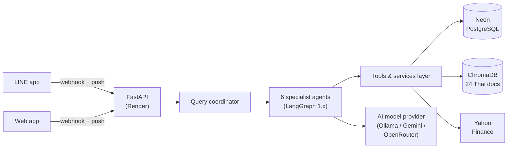

# Personal Finance AI

> Multi-Agent AI system for personal finance management designed for Thai users

English (this document) | [เวอร์ชันภาษาไทย](./README.md)

[](./.github/workflows/ci.yml)
[](https://www.python.org/downloads/)


[](./LICENSE)

## At a Glance

| | |
|---|---|
| **Architecture** | LangGraph multi-agent: Router + 6 specialists, Hub-and-Spoke (verified vs P2P/Hierarchical benchmarks) |
| **RAG** | ChromaDB, 24 Thai finance documents (official tax/SEC/SET PDFs), Recall@3 0.897 |
| **Measured quality** | Router accuracy 0.943 single-turn / 1.000 multi-turn · tax calculation 95% (MAE 3,000 THB) · hallucination 0 in headline answers (10/10) |
| **Engineering** | 1,901 tests, 92.7% coverage, mypy strict, pylint 10/10, TDD throughout |
| **Deployment** | FastAPI (14 REST endpoints) on Render + Neon Postgres, LINE chatbot, receipt OCR |
| **Evaluation** | Self-built 6-dimension evaluation framework: routing ablation (810 LLM calls), answer correctness, retrieval quality, hallucination detection, architecture benchmarks |

## What is This?

A finance assistant you can chat with in Thai. It can:

- calculate Thai personal income tax, including all the deductions
- record and categorize spending, and summarize by month
- watch stock prices, pull finance news, and manage a watchlist
- set financial goals and work out saving plans
- suggest what to do next, with a financial health score
- put everything together in a report (PDF/CSV)

## Key Features

### Multi-agent system (LangGraph)

A LangGraph graph with a router and 6 specialist agents:

- **Router Agent** - classifies the query and sends it to the right specialist
- **Tax Agent** - Thai personal income tax with all deductions
- **Expense Agent** - income/expense tracking, monthly summaries, category queries
- **Asset Monitoring Agent** - stock prices, finance news, watchlists
- **Planning Agent** - goals, saving plans, psychological cue detection
- **Recommendation Agent** - proactive advice and health scoring
- **Report Agent** - full reports with PDF/CSV export

### RAG Knowledge Base
ChromaDB vector store with 24 Thai finance documents (18 Markdown + 6 official PDFs) covering:
- Personal income tax, deductions, filing guides, VAT/withholding
- Thai stocks, mutual funds, ETFs, bonds, DCA strategy
- Budgeting, emergency funds, debt management
- Life/health insurance, social security
- Retirement and financial planning
- Digital assets & crypto (grounded on SEC/SET sources)

### Receipt OCR
Upload a receipt photo and the system auto-extracts items, amounts and
merchant, then drafts expense transactions for one-click confirmation
(`POST /ocr/receipt` → `POST /ocr/confirm`). Vision model is configurable
independently of the chat agent (`OCR_PROVIDER` + `OCR_MODEL`).

### LINE Chatbot
Chat with the same multi-agent system inside the LINE app:
- `POST /line/webhook` verifies `X-Line-Signature` (HMAC-SHA256) and acknowledges within LINE's ~1 s window
- The agent runs as a background task; the Thai answer is delivered via the Push Message API (reply tokens expire before slow agents finish)
- Each LINE account is auto-mapped to an app user + conversation (`line_user_mappings`), so chat history persists
- Account linking: send `เชื่อมต่อ <userId>` in LINE (command is copyable from the web sidebar card) to bind the chat to a web user; `ยกเลิกเชื่อมต่อ` / `unlink` or the website's "ยกเลิกการเชื่อมต่อ" button unbinds it
- A tappable Quick Reply menu (บันทึกรายจ่าย / วางแผน / หุ้น / ภาษี) mirrors the web clarify options

Architecture and sequence diagrams (chapter 3): [docs/diagrams.md](./docs/diagrams.md)

### Design decisions, backed by numbers

The architecture choices here come from measurements I ran, not hunches:

- **Chat history is the router's most valuable feature.** The ablation
  (810 LLM calls over 3 rounds) showed multi-turn accuracy going from
  0.733 to 1.000 once history is included. The strongest prompt layout
  also puts the role instruction after the history block, not before it.
- **Hub-and-Spoke wins on routing cost.** One LLM routing call per query,
  versus 1.8 for P2P and 2.0 for hierarchical, with O(N) coupling instead
  of O(N²). Latency was within noise (~3%), so cost is what separates them.
- **Money math goes through a typed calculator, not the LLM.** Tax
  computation hits 95% accuracy (MAE 3,000 THB) because the model calls
  a deterministic tool instead of doing arithmetic in its head.
- **Hallucination is reported in two layers, on purpose.** The regex
  evaluator flags 0.70 raw, but content-level analysis shows 10/10
  headline answers match the knowledge base. Both numbers are in the
  results instead of only the flattering one.

### API security (for public deployments)

- `X-API-Key` required on every endpoint except `/health` and
  `/line/webhook` (the LINE webhook verifies its own HMAC-SHA256 signature)
- Per-IP sliding-window rate limiting, default 30 req/min (set `0` to disable)
- See [`src/finance_ai/core/api_security.py`](./src/finance_ai/core/api_security.py)

## Demo

### Example session (real output)

This exchange is taken from the evaluation run (`tax_acc_001`, minimax-m3),
not a hand-written mock. The user types a Thai question, the router sends it
to the Tax Agent, and the agent calls the deterministic tax calculator:

> **User:** คำนวณภาษี เงินเดือน 50,000 บาทต่อเดือน ค่าลดหย่อนส่วนตัว 60,000
>
> **Finance AI:** จากการคำนวณ รายได้รวมทั้งปี 600,000 บาท หักค่าใช้จ่าย 50%
> (สูงสุด 100,000 บาท) และค่าลดหย่อนส่วนตัว 60,000 บาท ทำให้มีเงินได้สุทธิ
> 440,000 บาท และต้องเสียภาษี 21,500 บาท
>
> | รายการ | จำนวนเงิน (บาท) |
> |---|---:|
> | รายได้รวมทั้งปี | 600,000 |
> | ค่าใช้จ่าย (หัก 50% สูงสุด 100,000) | 100,000 |
> | ค่าลดหย่อนส่วนตัว | 60,000 |
> | **เงินได้สุทธิ** | **440,000** |
> | **ภาษีที่ต้องชำระ** | **21,500** |

Other things you can ask:

- "สรุปค่าใช้จ่ายเดือนนี้" → monthly expense summary with category breakdown
- "ซื้อ RMF ปีละ 100,000 ได้ลดหย่อนเท่าไหร่" → retirement-savings deduction, grounded in the RAG knowledge base
- "PTT.BK ราคาเท่าไหร่" → live quote via Yahoo Finance, and it can add symbols to your watchlist
- "ช่วยวางแผนเก็บเงิน 100,000 ใน 1 ปี" → saving plan with a monthly schedule
- Photo of a receipt → OCR extracts items and drafts expense rows for one-click confirmation

### Architecture at runtime



Full diagrams (chapter 3, including sequence diagrams): [docs/diagrams.md](./docs/diagrams.md)

## Quick Start

### Prerequisites
- Python 3.12 or higher
- [uv](https://docs.astral.sh/uv/) (for dependency management)
- OpenRouter API key ([create at https://openrouter.ai/keys](https://openrouter.ai/keys))
  - Or use Google Gemini / Ollama as alternative LLM providers

### Installation

```bash
# Clone the repository
git clone https://github.com/66070146-Pakkaphon/agenticaiforpersonalfinance.git
cd agenticaiforpersonalfinance

# Install dependencies
make install

# Copy environment variables template
cp .env.example .env

# Edit .env and add your API keys
#   At minimum set: LLM_PROVIDER (google | ollama | openrouter) + OPENROUTER_API_KEY
#   (ollama needs no API key — run it locally on http://localhost:11434)
nano .env

# Initialize the database (runs Alembic migrations to create all tables)
make init-db

# (Optional) load demo data - users, expenses, watchlist - so the UI
# is populated on first open
uv run python scripts/seed_demo.py

# Run tests to verify setup
make test
```

### Running the Application

```bash
# Start the FastAPI backend (development mode with auto-reload)
make dev

# Or run production server
make run
```

The API will be available at `http://localhost:8080`
Web UI (chat interface) at `http://localhost:8080/`
Interactive API docs at `http://localhost:8080/docs`

## Usage Examples

### Calculate Taxes

```python
from finance_ai.agents.llm_factory import create_chat_model
from finance_ai.agents.router_agent import orchestrate_query

result = orchestrate_query(
    "คำนวณภาษี เงินเดือน 1,200,000 บาท มีบุตร 2 คน ซื้อ RMF 100,000",
    chat_model=create_chat_model(),
    user_id="your-user-id",
)

print(result["intent"])    # "tax"
print(result["response"])  # Thai-language tax breakdown
```

### Chat with Streaming

```python
from finance_ai.agents.stream_utils import orchestrate_query_stream

for event in orchestrate_query_stream(
    "สรุปค่าใช้จ่ายเดือนนี้",
    chat_model=create_chat_model(),
    user_id="your-user-id",
):
    if event.event_type == "token":
        print(event.content, end="", flush=True)
```

## Project Structure

```
agenticaiforpersonalfinance/
├── src/finance_ai/
│   ├── agents/              # LangGraph agent implementations
│   │   ├── router_agent.py       # Intent classification + dispatch
│   │   ├── tax_agent.py          # Tax Agent (ReAct graph)
│   │   ├── expense_agent.py      # Expense Agent
│   │   ├── asset_monitoring_agent.py
│   │   ├── planning_agent.py
│   │   ├── recommendation_agent.py
│   │   ├── report_agent.py
│   │   ├── llm_factory.py        # LLM provider factory
│   │   ├── stream_utils.py       # Streaming agent responses
│   │   └── prompts.py            # System prompts
│   ├── line/               # LINE chatbot (webhook, mapping, push)
│   ├── tools/              # Service layer (business logic + tools)
│   ├── rag/                # ChromaDB vector store + embeddings
│   ├── database/           # SQLAlchemy models + CRUD + Alembic
│   ├── evaluation/         # Evaluation framework (6 dimensions)
│   ├── core/               # Config, logging, API security, LLM clients
│   ├── static/             # Web frontend (HTML/JS/CSS served by FastAPI)
│   └── main.py             # FastAPI app entry point
├── tests/                  # Test suite (mirrors src/)
├── alembic/                # Database migrations
├── docs/
│   ├── diagrams.md         # Architecture + sequence diagrams (Mermaid)
│   └── knowledge_base/     # RAG source documents (Thai finance)
├── scripts/                # Utility scripts (eval, PDF generation)
├── .github/workflows/      # CI/CD pipeline
├── pyproject.toml          # Dependencies and tool configs
├── Makefile                # Common commands
└── README.md
```

## Development

### Setup Development Environment

```bash
# Install pre-commit hooks
pre-commit install

# Run all quality checks
make check

# Run specific checks
make format      # Auto-format code
make lint        # Run linter
make typecheck   # Check type hints
make test        # Run tests
```

### Code Quality Standards

This project follows strict code quality standards:

- Type hints on all functions
- Test coverage >90%
- Lint score >9.0/10
- Functions under 20 lines
- Docstrings on every function

### Available Make Commands

```bash
make install          # Install dependencies (+ pre-commit hooks)
make init-db          # Initialize database (run Alembic migrations)
make migrate          # Create a new Alembic migration (prompts for a message)
make dev              # Run development server with auto-reload (port 8080)
make run              # Run production server (port 8080, 4 workers)
make test             # Run tests with coverage
make coverage         # Generate HTML coverage report (htmlcov/)
make lint             # Run pylint
make format           # Format code with black
make format-check     # Check formatting without writing (CI mode)
make typecheck        # Type checking with mypy
make check            # Run all checks (format, lint, typecheck, test)
make shell            # Open an IPython shell with app context
make clean            # Clean generated files
make evaluate         # Run the full evaluation framework
make evaluate-routing # Run routing evaluation only
make evaluate-rag     # Run RAG evaluation only
make evaluate-compare # Compare multiple LLM providers
```

## LLM Providers

The system supports multiple LLM providers (configured in `.env`):

| Provider | Config key | Production model |
|---|---|---|
| OpenRouter (production default, also used for OCR) | `llm_provider=openrouter` | `minimax/minimax-m3` |
| Google Gemini | `llm_provider=google` | `gemini-3.5-flash` |
| Ollama Cloud | `llm_provider=ollama` | `minimax-m3` |
| OpenRouter | `llm_provider=openrouter` | `deepseek/deepseek-chat-v3.1` |

## Research & Evaluation Results

The evaluation framework (6 dimensions) backs the thesis chapter 4.
Result drafts with full tables live in `docs/thesis-results/`:

| Chapter | Topic | Headline result |
|---|---|---|
| [4.1](./docs/thesis-results/4.1-routing-ablation.md) | Router accuracy + feature ablation (810 calls, 3 rounds) | base 0.943; multi-turn 0.733 → **1.000** with chat history enabled |
| [4.2](./docs/thesis-results/4.2-answer-correctness.md) | Answer correctness (tax accuracy + hallucination) | tax **95%** (MAE 3,000 THB); hallucination headline **10/10** |
| [4.3](./docs/thesis-results/4.3-retrieval-quality.md) | RAG retrieval quality (39 queries, one-shot index of 1,586 chunks) | Recall@3 **0.897**, MRR **0.808** |
| [4.4](./docs/thesis-results/4.4-architecture-comparison.md) | Architecture comparison (Hub-and-Spoke vs P2P/Hierarchical) | routing calls **1.0** vs 1.8/2.0; coupling O(N) vs O(N²) |
| [model comparison](./docs/model-comparison.md) | Multi-provider routing/answer benchmarks | minimax-m3 0.94, gemini-3.5-flash 0.91 (±0.05) |

Run the evaluations yourself:

```bash
make evaluate-routing   # router accuracy + ablation (see docs/deployment.md flags)
make evaluate-rag       # RAG retrieval metrics
make evaluate-compare   # multi-provider comparison
```

## Deployment

Full guide (Render free tier + Neon Postgres, env variables, troubleshooting):
[docs/deployment.md](./docs/deployment.md). The Render blueprint is
[`render.yaml`](./render.yaml) (LLM + OCR via OpenRouter, RAG embeddings via Google).

## Contributing

1. Fork the repository
2. Create a feature branch (`git checkout -b feature/amazing-feature`)
3. Commit your changes (`git commit -m 'Add amazing feature'`)
4. Push to the branch (`git push origin feature/amazing-feature`)
5. Open a Pull Request

All PRs must:
- Pass all tests (`make check`)
- Have >90% coverage
- Pass linting (score >9.0)
- Pass type checking

## License

This project is licensed for **personal and educational use only**
(see the [LICENSE](./LICENSE) file). Commercial use requires prior
written permission from the copyright holder. Not financial advice.

## Acknowledgments

- Agent orchestration: [LangGraph](https://github.com/langchain-ai/langgraph)
- LLM: [OpenRouter](https://openrouter.ai/) (or Google Gemini / Ollama)
- Vector store: [ChromaDB](https://www.trychroma.com/)
- Market data: [yfinance](https://github.com/ranaroussi/yfinance), [SET](https://www.set.or.th/), [AIMC](https://www.aimc.or.th/)
- Tax rules: [Thai Revenue Department](https://www.rd.go.th/)

---

**Disclaimer**: This tool is for informational purposes only and does not constitute financial advice. Always consult with a qualified financial advisor before making investment decisions. Tax calculations are based on current Thai tax laws and may not reflect the latest changes.
