# Architecture & Sequence Diagrams

Complete diagram set for thesis chapter 3 (system design) and the
evaluation harness (chapter 4). All diagrams are drawn from the actual
code in `src/finance_ai/` (verified 2026) and rendered as Mermaid —
GitHub displays them natively.

**Page fit:** every diagram is sized to stay readable when printed on a
single A4 page (portrait, ~170 mm printable width). Large views are
split into focused sub-diagrams (1a–1c, 3a–3c, 8a–8e, 9a–9b, 12a–12b)
instead of one sprawling graph.

**Export to images for the thesis PDF:**

```bash
npm install -g @mermaid-js/mermaid-cli
mmdc -i input.mmd -o slide.png -w 1200 -b white
```

**Contents**

| # | Diagram | Thesis use |
|---|---|---|
| 1a | System overview | 3.1 Overall design |
| 1b | FastAPI endpoint surface | 3.1 API design |
| 1c | Agent-to-tool wiring | 3.1 Layered design |
| 2 | Router decision flow | 3.2 Intent routing |
| 3a | ReAct agent graph | 3.3 Agent design |
| 3b | Tax Agent graph | 3.3 Agent design |
| 3c | Recommendation Agent graph | 3.3 Agent design |
| 4a | Recommendation guardrail checks | 3.4 Safety design |
| 4b | Guardrail in the advice chain | 3.4 Safety design |
| 5 | Chat query sequence (web, incl. SSE) | 3.5 Request lifecycle |
| 6 | LINE chatbot sequence | 3.6 Chatbot deployment |
| 7 | RAG retrieval flow | 3.7 Knowledge grounding |
| 8a | ERD — income & deductions | 3.8 Data model |
| 8b | ERD — transactions & tax filings | 3.8 Data model |
| 8c | ERD — goals & holdings | 3.8 Data model |
| 8d | ERD — watchlist & risk profile | 3.8 Data model |
| 8e | ERD — conversation & automation | 3.8 Data model |
| 9a | Receipt OCR flow | 3.9 Data ingestion |
| 9b | Bank statement CSV flow | 3.9 Data ingestion |
| 10 | Background scheduler flow | 3.10 Scheduled tasks |
| 11 | Deployment view | 3.11 / 5.1 Deployment |
| 12a | Evaluation pipeline | 4.x Experiments |
| 12b | Model comparison & benchmark | 4.x Experiments |
| 13 | LLM provider abstraction | 3.3 / 5.2 Model strategy |

---

## 1a. System Overview

Clients reach the FastAPI backend through two channels (web UI, LINE
webhook); the orchestrator routes to six specialist LangGraph agents;
agents call the service/tool layer, which persists to Neon Postgres and
grounds answers in ChromaDB.

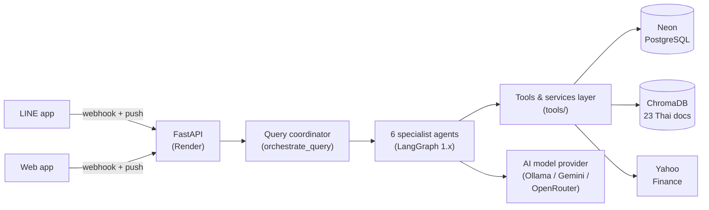
```mermaid
flowchart LR
    LINE["LINE app"] & WEB["Web app"] -->|"webhook + push"| API["FastAPI<br/>(Render)"]
    API --> ORCH["Query coordinator<br/>(orchestrate_query)"]
    ORCH --> AG["6 specialist agents<br/>(LangGraph 1.x)"]
    AG --> TL["Tools & services layer<br/>(tools/)"]
    TL --> DB[("Neon<br/>PostgreSQL")]
    TL --> CH[("ChromaDB<br/>23 Thai docs")]
    TL --> YF["Yahoo<br/>Finance"]
    AG --> LLM["AI model provider<br/>(Ollama / Gemini /<br/>OpenRouter)"]
```

## 1b. FastAPI Endpoint Surface

21 endpoints grouped by function. Chat and LINE go through the
orchestrator; every other group talks to the service layer directly.

| Group | Endpoints | Purpose |
|---|---|---|
| Chat | `POST /chat`, `GET /chat/stream` (SSE) | agent Q&A, streaming tokens |
| Conversations | `GET/POST /conversations`, `GET /conversations/{id}/messages` | history management |
| Upload | `POST /upload/receipt`, `POST /upload/bank-statement`, `POST /transactions/confirm` | document ingestion |
| Assets | `GET /assets/search`, `POST /assets/fetch`, watchlist CRUD, `GET /assets/notifications` (+ `/read`) | market data & watchlist |
| Risk | `POST /risk-assessment/submit`, `GET /risk-assessment/latest` | risk questionnaire |
| LINE | `POST /line/webhook`, `POST /line/unlink` | chatbot channel |
| Misc | `GET /dashboard`, `GET /health` | dashboard data, liveness |

## 1c. Agent-to-Tool Wiring

Which agent uses which tools, and where each tool persists. All agents
share the same LangGraph state (`messages`, `user_id`,
`db_session_factory` injected into tools via `InjectedState`).

| Agent | Tools (`tools/`) | Reads / writes |
|---|---|---|
| Tax | `tax_calculator`, `tax_service`, income & deduction CRUD, RAG | Postgres, ChromaDB |
| Expense | `expense_service`, `bank_statement_parser`, RAG | Postgres, ChromaDB |
| Asset Monitoring | `market_data_service`, `price_client` (quote → chart fallback, 60 s TTL cache), watchlist CRUD | Postgres, Yahoo Finance |
| Planning | `planning_service`, `planning_calculator`, goal CRUD | Postgres |
| Recommendation | `recommendation_service`, `recommendation_guardrail`, RAG | Postgres, ChromaDB |
| Report | `report_service`, RAG | Postgres, ChromaDB |

All tools land in one of three shared backends:

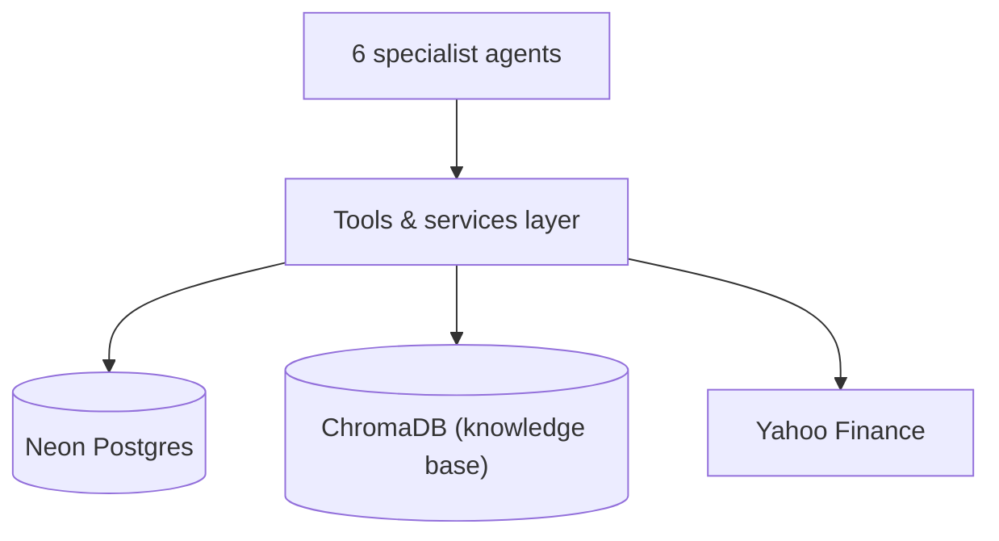
```mermaid
flowchart TB
    AG["6 specialist agents"] --> TL["Tools & services layer"]
    TL --> DB[("Neon Postgres")]
    TL --> CH[("ChromaDB (knowledge base)")]
    TL --> YF["Yahoo Finance"]
```

---

## 2. Router Decision Flow

`orchestrate_query` classifies each query into one of 8 intents
(`OrchestratorDecision`). Deterministic code runs before and after the
LLM call: uppercase-ticker pre-search adds a routing hint, and a 0.7
confidence threshold decides between acting and asking back. Non-finance
chatter (`unknown`) skips clarification and goes to general chat.

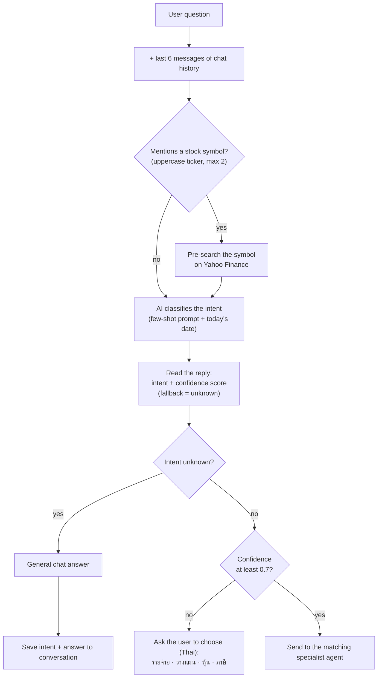
```mermaid
flowchart TB
    Q["User question"] --> HIST["+ last 6 messages of chat history"]
    HIST --> TOK{"Mentions a stock symbol?<br/>(uppercase ticker, max 2)"}
    TOK -->|"yes"| SEARCH["Pre-search the symbol<br/>on Yahoo Finance"]
    TOK -->|"no"| LLM["AI classifies the intent<br/>(few-shot prompt + today's date)"]
    SEARCH --> LLM
    LLM --> PARSE["Read the reply:<br/>intent + confidence score<br/>(fallback = unknown)"]
    PARSE --> UNK{"Intent unknown?"}
    UNK -->|"yes"| GEN["General chat answer"]
    UNK -->|"no"| CONF{"Confidence<br/>at least 0.7?"}
    CONF -->|"no"| CLARIFY["Ask the user to choose (Thai):<br/>รายจ่าย · วางแผน · หุ้น · ภาษี"]
    CONF -->|"yes"| ROUTE["Send to the matching specialist agent"]
    GEN --> RESP["Save intent + answer to conversation"]
```

Intent-to-agent routing table:

| Intent | Agent |
|---|---|
| `tax` | Tax Agent (diagram 3b) |
| `expense` | Expense Agent (ReAct, 3a) |
| `asset_monitoring` | Asset Monitoring Agent (3a) |
| `planning` | Planning Agent (3a) |
| `recommendation` | Recommendation Agent (3c) |
| `report` | Report Agent (3a) |
| `general` / `unknown` | General chat (no specialist) |

---

## 3a. Standard ReAct Agent Graph

Used by Expense, Planning, Asset Monitoring, and Report. The LLM node
decides each turn whether to call a tool; `ToolNode` executes bound
LangChain tools and feeds results back.

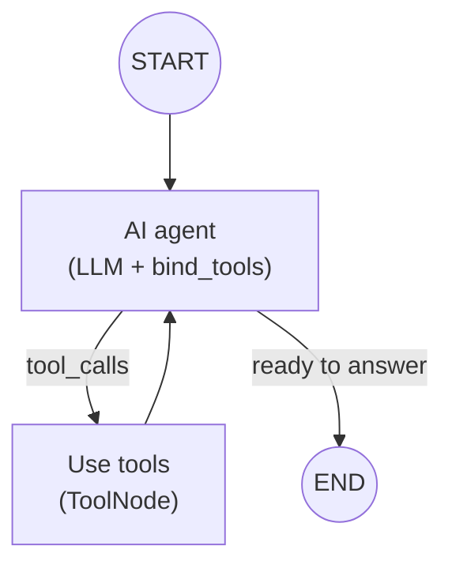
```mermaid
flowchart TB
    S((START)) --> A["AI agent<br/>(LLM + bind_tools)"]
    A -->|"tool_calls"| T["Use tools<br/>(ToolNode)"]
    A -->|"ready to answer"| E((END))
    T --> A
```

## 3b. Tax Agent Graph

A fixed three-node pipeline: the first LLM turn plans tool calls, tools
run, then a dedicated `respond` node produces the final answer (looping
back to tools only if more data is needed).

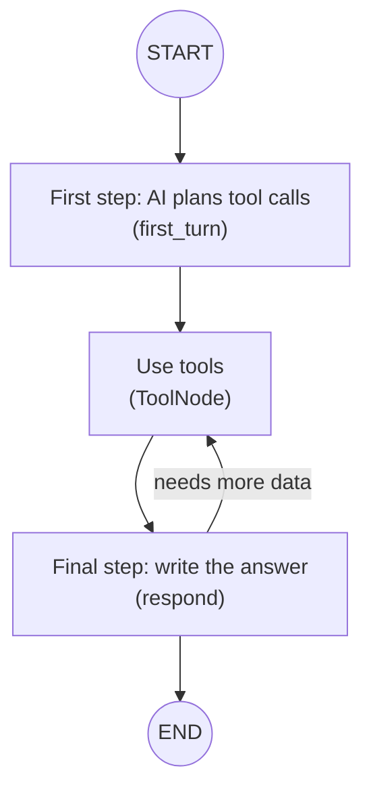
```mermaid
flowchart TB
    S((START)) --> F["First step: AI plans tool calls<br/>(first_turn)"]
    F --> T["Use tools<br/>(ToolNode)"]
    T --> R["Final step: write the answer<br/>(respond)"]
    R -->|"needs more data"| T
    R --> E((END))
```

## 3c. Recommendation Agent Graph

ReAct plus a deterministic guardrail node after the final answer (see
diagram 4a). Runs at temperature 0.3 (other agents: 0.7) with the user's
latest risk assessment injected into the system prompt. Compiled graphs
are cached per model (`graph_cache`).

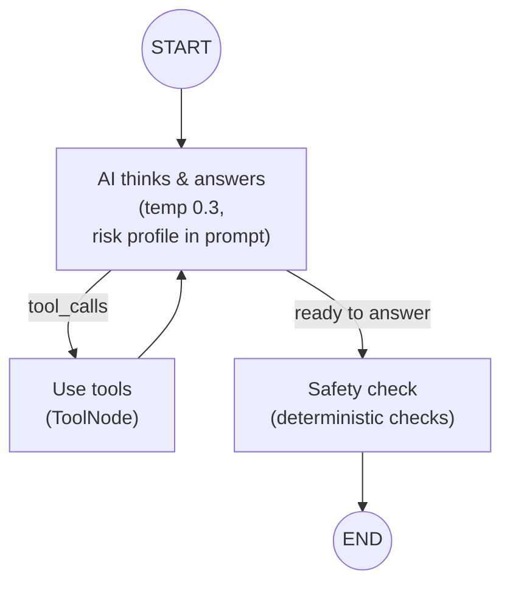
```mermaid
flowchart TB
    S((START)) --> A["AI thinks & answers<br/>(temp 0.3,<br/>risk profile in prompt)"]
    A -->|"tool_calls"| T["Use tools<br/>(ToolNode)"]
    T --> A
    A -->|"ready to answer"| G["Safety check<br/>(deterministic checks)"]
    G --> E((END))
```

---

## 4a. Recommendation Guardrail Checks

Deterministic post-generation checks on the final answer
(`tools/recommendation_guardrail.py`). Warnings are appended in place
(the `AIMessage` id is preserved so downstream extraction still works).
The guardrail never raises — on any DB error it degrades to a no-op.

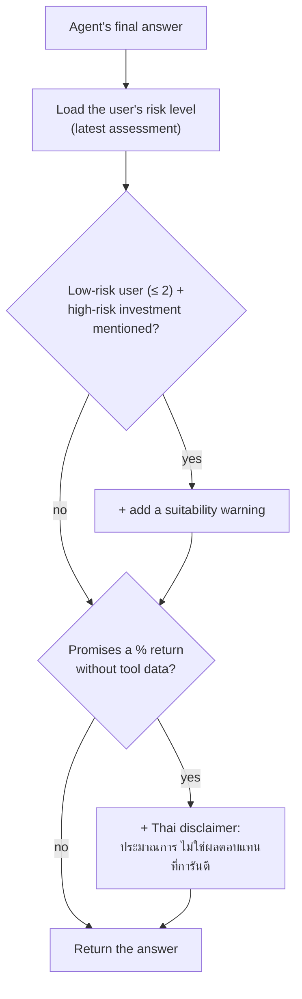
```mermaid
flowchart TB
    A["Agent's final answer"] --> RL["Load the user's risk level<br/>(latest assessment)"]
    RL --> C1{"Low-risk user (≤ 2) +<br/>high-risk investment mentioned?"}
    C1 -->|"yes"| W1["+ add a suitability warning"]
    C1 -->|"no"| C2{"Promises a % return<br/>without tool data?"}
    W1 --> C2
    C2 -->|"yes"| W2["+ Thai disclaimer:<br/>ประมาณการ ไม่ใช่ผลตอบแทน<br/>ที่การันตี"]
    C2 -->|"no"| OUT["Return the answer"]
    W2 --> OUT
```

## 4b. Guardrail in the Advice Chain

Defense in depth: risk context and prompt rules constrain the agent
before generation; the guardrail checks the output after.

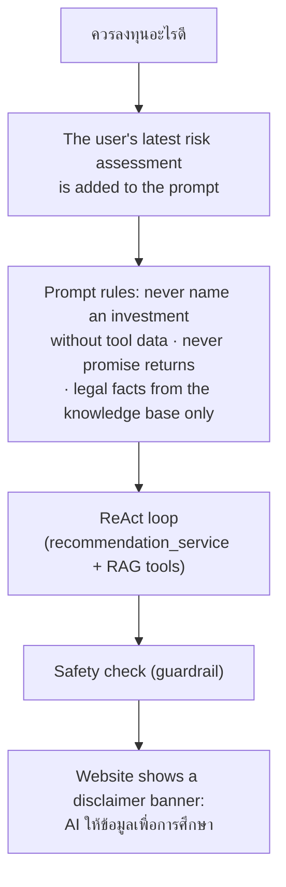
```mermaid
flowchart TB
    Q["ควรลงทุนอะไรดี"] --> CTX["The user's latest risk assessment<br/>is added to the prompt"]
    CTX --> RULES["Prompt rules: never name an investment<br/>without tool data · never promise returns<br/>· legal facts from the knowledge base only"]
    RULES --> LOOP["ReAct loop<br/>(recommendation_service + RAG tools)"]
    LOOP --> GUARD["Safety check (guardrail)"]
    GUARD --> UI["Website shows a disclaimer banner:<br/>AI ให้ข้อมูลเพื่อการศึกษา"]
```

---

## 5. Chat Query Sequence (Web)

Two request paths: blocking `POST /chat` and streaming
`GET /chat/stream` (SSE with `token` / `complete` events). Both persist
the user and assistant messages to the conversation.

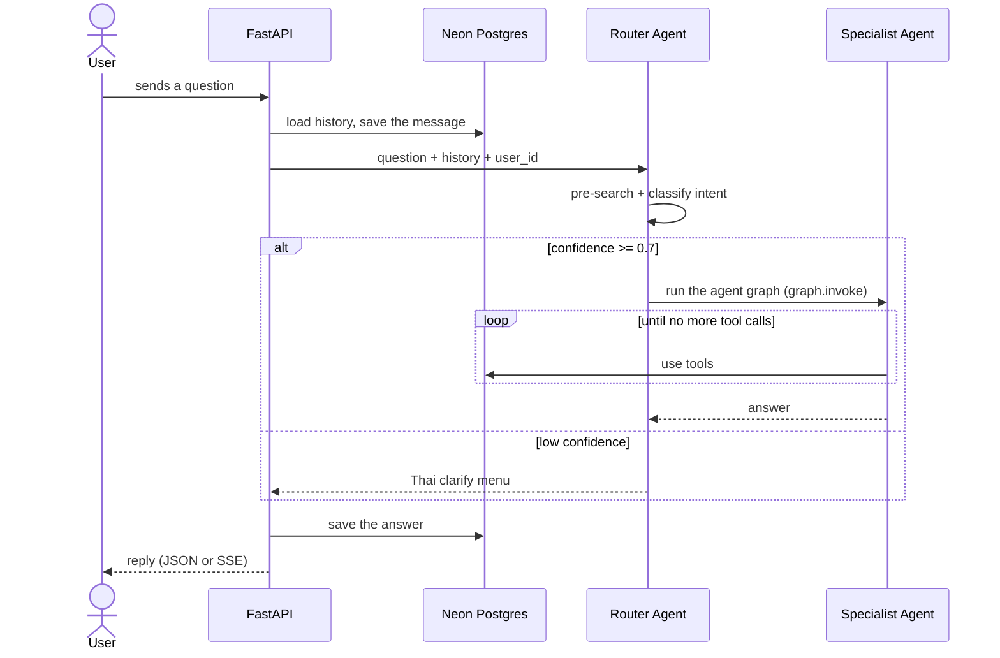
```mermaid
sequenceDiagram
    actor U as User
    participant API as FastAPI
    participant DB as Neon Postgres
    participant R as Router Agent
    participant A as Specialist Agent

    U->>API: sends a question
    API->>DB: load history, save the message
    API->>R: question + history + user_id
    R->>R: pre-search + classify intent
    alt confidence >= 0.7
        R->>A: run the agent graph (graph.invoke)
        loop until no more tool calls
            A->>DB: use tools
        end
        A-->>R: answer
    else low confidence
        R-->>API: Thai clarify menu
    end
    API->>DB: save the answer
    API-->>U: reply (JSON or SSE)
```

---

## 6. LINE Chatbot Sequence (Push Model)

LINE expects the webhook to return within ~1 s, but agents take 10–30 s.
The webhook verifies the HMAC signature, returns 200 immediately, and
runs the agent as a background task; the answer is delivered via the
Push API. A processing ack is pushed first (bots have no typing
indicator), and answers are converted from markdown to LINE plain text
before pushing.

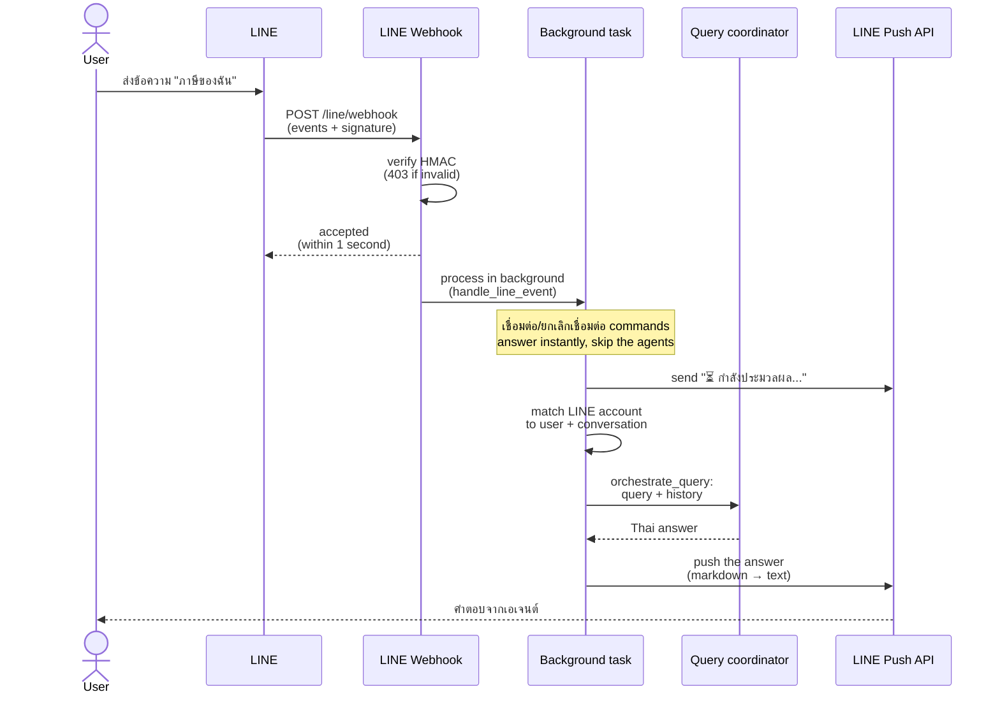
```mermaid
sequenceDiagram
    actor U as User
    participant L as LINE
    participant W as LINE Webhook
    participant B as Background task
    participant O as Query coordinator
    participant P as LINE Push API

    U->>L: ส่งข้อความ "ภาษีของฉัน"
    L->>W: POST /line/webhook<br/>(events + signature)
    W->>W: verify HMAC<br/>(403 if invalid)
    W-->>L: accepted<br/>(within 1 second)
    W->>B: process in background<br/>(handle_line_event)
    Note over B: เชื่อมต่อ/ยกเลิกเชื่อมต่อ commands<br/>answer instantly, skip the agents
    B->>P: send "⏳ กำลังประมวลผล..."
    B->>B: match LINE account<br/>to user + conversation
    B->>O: orchestrate_query:<br/>query + history
    O-->>B: Thai answer
    B->>P: push the answer<br/>(markdown → text)
    P-->>U: คำตอบจากเอเจนต์
```

---

## 7. RAG Retrieval Flow

23 Thai finance documents are chunked, embedded, and indexed in
ChromaDB at bootstrap; `rag_tool` exposes `search_finance_knowledge` so
regulatory and product facts come from retrieved context instead of
model memory. The index is rebuilt whenever empty (Render's disk is
ephemeral).

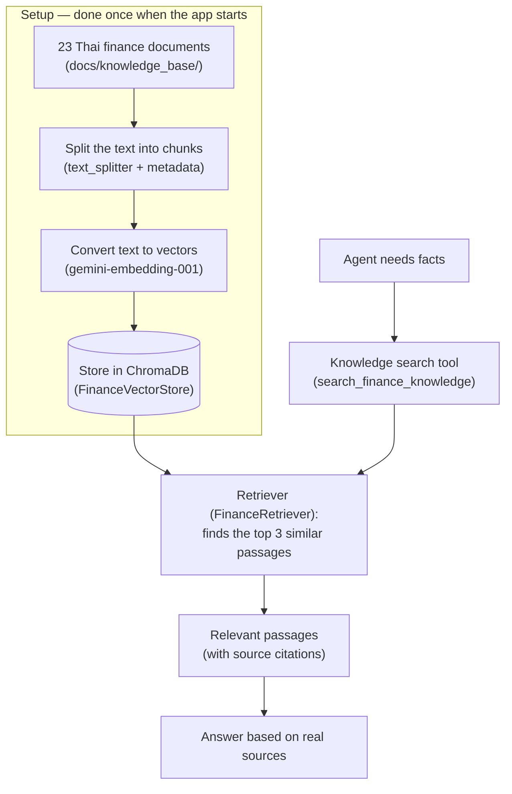
```mermaid
flowchart TB
    subgraph ingest["Setup — done once when the app starts"]
        direction TB
        DOC["23 Thai finance documents<br/>(docs/knowledge_base/)"] --> SPLIT["Split the text into chunks<br/>(text_splitter + metadata)"]
        SPLIT --> EMB["Convert text to vectors<br/>(gemini-embedding-001)"]
        EMB --> CH[("Store in ChromaDB<br/>(FinanceVectorStore)")]
    end
    Q["Agent needs facts"] --> RAGT["Knowledge search tool<br/>(search_finance_knowledge)"]
    CH --> RET["Retriever (FinanceRetriever):<br/>finds the top 3 similar passages"]
    RAGT --> RET
    RET --> CTX["Relevant passages<br/>(with source citations)"]
    CTX --> ANS["Answer based on real sources"]
```

---

## 8a. ERD — Income & Deductions

The data model is shown as five A4-sized figures (8a–8e) sharing one
`users` hub. All money columns are `Decimal` (`Numeric`); IDs are
36-char UUID strings; all `user_id` FKs cascade on delete. Only key
columns are shown — see `database/models/` for the full list.

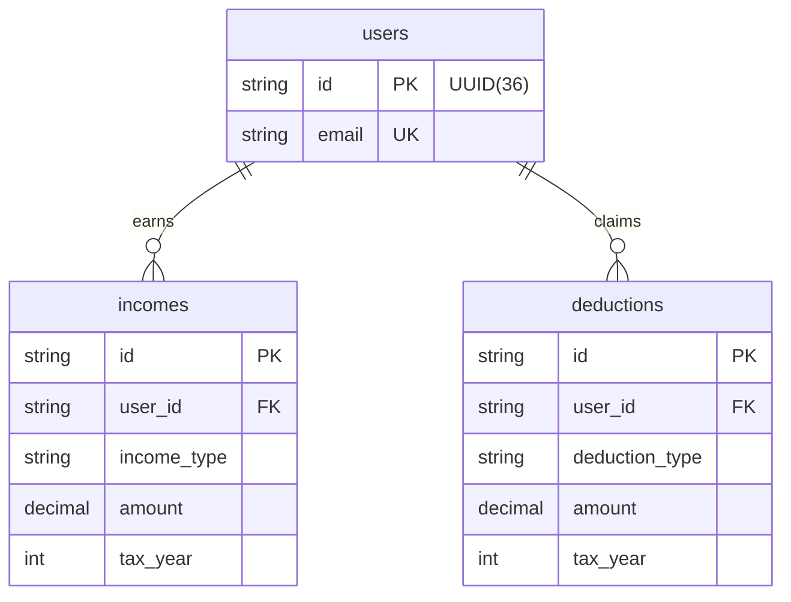
```mermaid
erDiagram
    users ||--o{ incomes : "earns"
    users ||--o{ deductions : "claims"

    users {
        string id PK "UUID(36)"
        string email UK
    }
    incomes {
        string id PK
        string user_id FK
        string income_type
        decimal amount
        int tax_year
    }
    deductions {
        string id PK
        string user_id FK
        string deduction_type
        decimal amount
        int tax_year
    }
```

Columns not shown: `incomes.pay_period / employer_name / withholding_tax`
and `deductions.maximum_allowed`.

## 8b. ERD — Transactions & Tax Filings

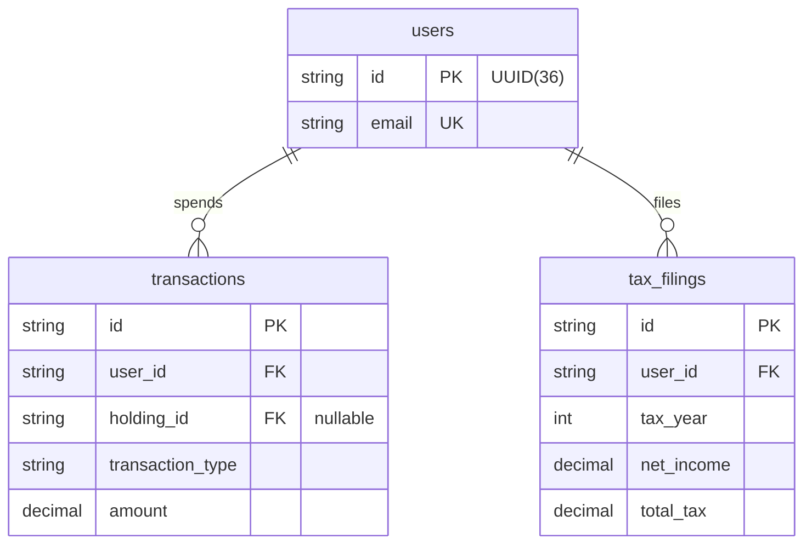
```mermaid
erDiagram
    users ||--o{ transactions : "spends"
    users ||--o{ tax_filings : "files"

    users {
        string id PK "UUID(36)"
        string email UK
    }
    transactions {
        string id PK
        string user_id FK
        string holding_id FK "nullable"
        string transaction_type
        decimal amount
    }
    tax_filings {
        string id PK
        string user_id FK
        int tax_year
        decimal net_income
        decimal total_tax
    }
```

Columns not shown: `transactions.quantity / transaction_date` and
`tax_filings.gross_income / total_deductions / effective_tax_rate /
tax_due_or_refund / filing_status` (always `draft`).

## 8c. ERD — Goals & Holdings

Matched buys/sells in `transactions` link back to a holding through
the nullable `holding_id`.

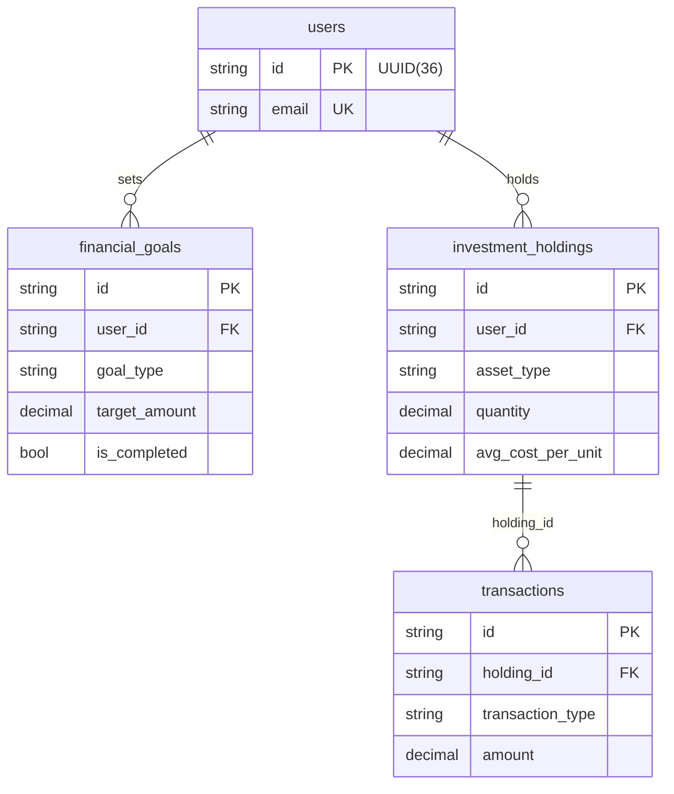
```mermaid
erDiagram
    users ||--o{ financial_goals : "sets"
    users ||--o{ investment_holdings : "holds"
    investment_holdings ||--o{ transactions : "holding_id"

    users {
        string id PK "UUID(36)"
        string email UK
    }
    financial_goals {
        string id PK
        string user_id FK
        string goal_type
        decimal target_amount
        bool is_completed
    }
    investment_holdings {
        string id PK
        string user_id FK
        string asset_type
        decimal quantity
        decimal avg_cost_per_unit
    }
    transactions {
        string id PK
        string holding_id FK
        string transaction_type
        decimal amount
    }
```

Columns not shown: `financial_goals.name / current_amount / target_date`
and `investment_holdings.symbol / total_cost / current_value`.

## 8d. ERD — Watchlist & Risk Profile

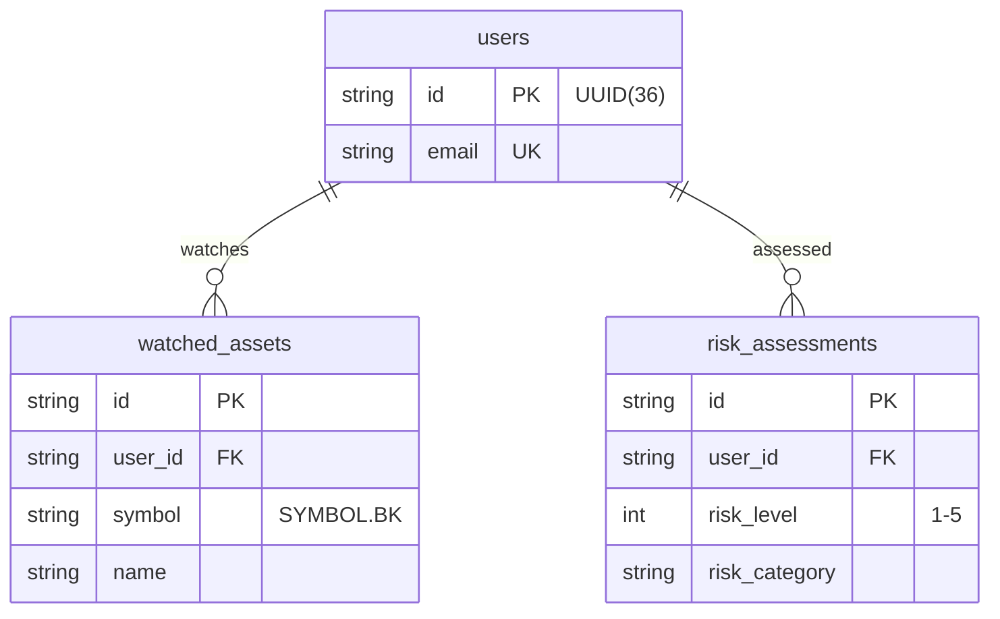
```mermaid
erDiagram
    users ||--o{ watched_assets : "watches"
    users ||--o{ risk_assessments : "assessed"

    users {
        string id PK "UUID(36)"
        string email UK
    }
    watched_assets {
        string id PK
        string user_id FK
        string symbol "SYMBOL.BK"
        string name
    }
    risk_assessments {
        string id PK
        string user_id FK
        int risk_level "1-5"
        string risk_category
    }
```

Columns not shown: `risk_assessments.answers (JSON) / total_score` —
the latest assessment feeds the Recommendation Agent's guardrail
(diagram 4a) and system prompt.

## 8e. ERD — Conversation & Automation

Chat history, the LINE user mapping, and the scheduled-fetch pipeline.
Neon Postgres enforces the FKs (SQLite never did), so auto-provisioning
(`ensure_user_exists`, LINE mapping) runs before any self-service write.

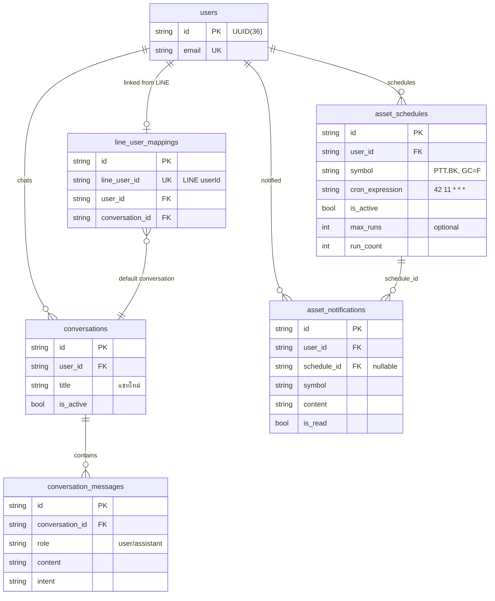
```mermaid
erDiagram
    users ||--o{ conversations : "chats"
    users ||--o| line_user_mappings : "linked from LINE"
    users ||--o{ asset_schedules : "schedules"
    users ||--o{ asset_notifications : "notified"
    conversations ||--o{ conversation_messages : "contains"
    line_user_mappings }o--|| conversations : "default conversation"
    asset_schedules ||--o{ asset_notifications : "schedule_id"

    users {
        string id PK "UUID(36)"
        string email UK
    }
    conversations {
        string id PK
        string user_id FK
        string title "แชทใหม่"
        bool is_active
    }
    conversation_messages {
        string id PK
        string conversation_id FK
        string role "user/assistant"
        string content
        string intent
    }
    line_user_mappings {
        string id PK
        string line_user_id UK "LINE userId"
        string user_id FK
        string conversation_id FK
    }
    asset_schedules {
        string id PK
        string user_id FK
        string symbol "PTT.BK, GC=F"
        string cron_expression "42 11 * * *"
        bool is_active
        int max_runs "optional"
        int run_count
    }
    asset_notifications {
        string id PK
        string user_id FK
        string schedule_id FK "nullable"
        string symbol
        string content
        bool is_read
    }
```

---

## 9a. Receipt OCR Flow

Receipts, payslips, and slips (image or PDF). OCR output is a **draft**
— nothing is persisted until the user reviews and confirms.

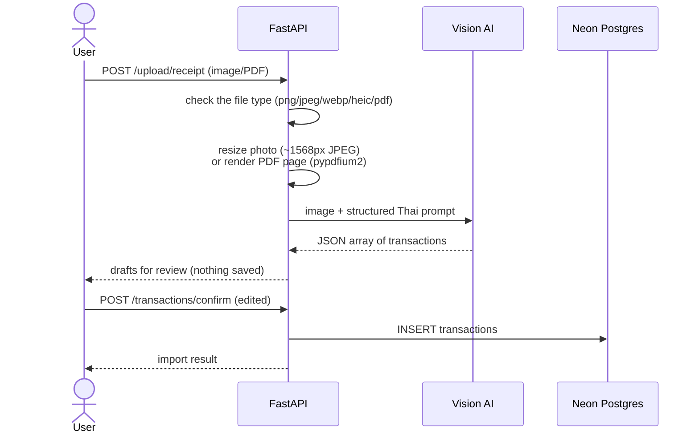
```mermaid
sequenceDiagram
    actor U as User
    participant API as FastAPI
    participant OCR as Vision AI
    participant DB as Neon Postgres

    U->>API: POST /upload/receipt (image/PDF)
    API->>API: check the file type (png/jpeg/webp/heic/pdf)
    API->>API: resize photo (~1568px JPEG)<br/>or render PDF page (pypdfium2)
    API->>OCR: image + structured Thai prompt
    OCR-->>API: JSON array of transactions
    API-->>U: drafts for review (nothing saved)
    U->>API: POST /transactions/confirm (edited)
    API->>DB: INSERT transactions
    API-->>U: import result
```

## 9b. Bank Statement CSV Flow

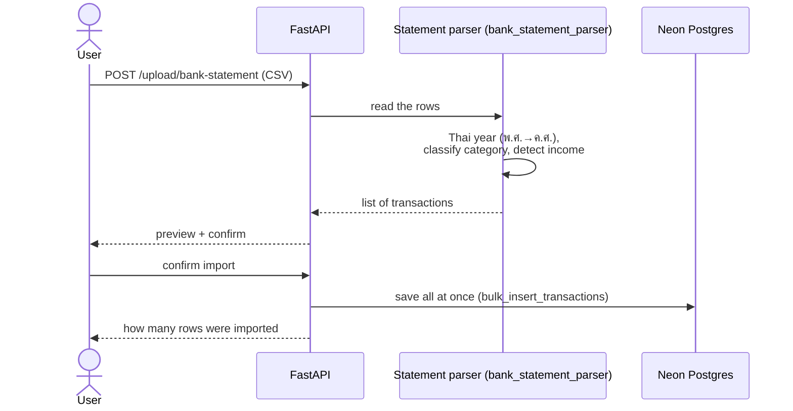
```mermaid
sequenceDiagram
    actor U as User
    participant API as FastAPI
    participant P as Statement parser (bank_statement_parser)
    participant DB as Neon Postgres

    U->>API: POST /upload/bank-statement (CSV)
    API->>P: read the rows
    P->>P: Thai year (พ.ศ.→ค.ศ.),<br/>classify category, detect income
    P-->>API: list of transactions
    API-->>U: preview + confirm
    U->>API: confirm import
    API->>DB: save all at once (bulk_insert_transactions)
    API-->>U: how many rows were imported
```

---

## 10. Background Scheduler Flow

APScheduler runs in-process (Asia/Bangkok). Every `asset_schedule` row
becomes a cron job restored at startup; jobs fetch price + news, write
`asset_notifications` rows, and surface as a dashboard badge.

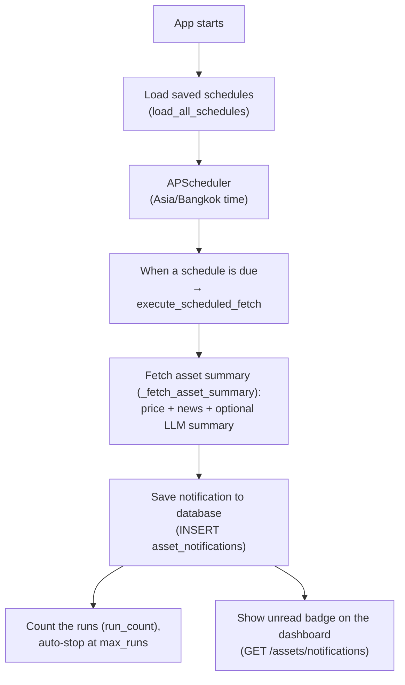
```mermaid
flowchart TB
    S["App starts"] --> L["Load saved schedules<br/>(load_all_schedules)"]
    L --> APS["APScheduler<br/>(Asia/Bangkok time)"]
    APS --> J["When a schedule is due<br/>→ execute_scheduled_fetch"]
    J --> F["Fetch asset summary (_fetch_asset_summary):<br/>price + news + optional LLM summary"]
    F --> N["Save notification to database<br/>(INSERT asset_notifications)"]
    N --> C["Count the runs (run_count),<br/>auto-stop at max_runs"]
    N --> B["Show unread badge on the dashboard<br/>(GET /assets/notifications)"]
```

---

## 11. Deployment View

One free-tier Render service (Singapore) backed by Neon Postgres.
Migrations and the RAG index rebuild on every boot because the disk is
ephemeral; the service sleeps after 15 min idle (~60 s cold start).
Secrets (`DB_URL`, `OLLAMA_API_KEY`, `OCR_API_KEY`, LINE channel
secret/token, optional `GOOGLE_API_KEY`) live in Render env vars, never
committed.

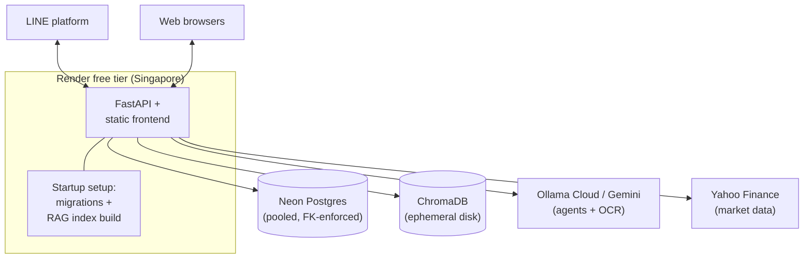
```mermaid
flowchart TB
    L["LINE platform"] <--> APP
    W["Web browsers"] <--> APP
    subgraph R["Render free tier (Singapore)"]
        APP["FastAPI +<br/>static frontend"]
        APP --- BOOT["Startup setup:<br/>migrations +<br/>RAG index build"]
    end
    APP --> PG[("Neon Postgres<br/>(pooled, FK-enforced)")]
    APP --> CH[("ChromaDB<br/>(ephemeral disk)")]
    APP --> LLM["Ollama Cloud / Gemini<br/>(agents + OCR)"]
    APP --> YF["Yahoo Finance<br/>(market data)"]
```

---

## 12a. Evaluation Pipeline

The harness runs the 6 YAML datasets through the real agent graphs,
scores each dimension, and reports. Failures count as failures — a
generation that dies after retries is scored, not retried away.

```mermaid
flowchart TB
    DS["6 YAML datasets (data/evaluation/):<br/>routing (226 cases) · tax accuracy · RAG retrieval<br/>hallucination · quality (LLM judge) · advice safety"]
    CLI["Run command<br/>(cli.py --eval)"] --> RUN
    DS --> RUN["Evaluation runner<br/>(real agent graphs, per-case isolation,<br/>retry + backoff)"]
    RUN --> SUT["System under test:<br/>router + 6 agents + guardrail<br/>+ FinanceRetriever"]
    SUT --> RPT["Report generator<br/>(aggregate + per-case)"]
    RPT --> OUT["Results for chapter 4"]
```

## 12b. Model Comparison & Architecture Benchmark

The same datasets run across providers for the comparison matrix;
`architecture_benchmark.py` compares this multi-agent system against a
single-agent baseline.

```mermaid
flowchart TB
    MC["Model comparison (model_comparison.py):<br/>same tests, many AI providers"] --> RUN["Evaluation runner"]
    AB["Architecture benchmark<br/>(architecture_benchmark.py)"] --> SUT
    RUN --> SUT["router + 6 agents"]
    AB2["Baseline: single general agent<br/>(same tools)"] --> SUT2["one general agent"]
    RUN --> RPT["Report generator"]
    AB --> RPT
    SUT --> RPT
    RPT --> OUT["Comparison table:<br/>7 models × 6 dimensions<br/>+ architecture results"]
```

Measured dimensions and their evaluators:

| Eval | Evaluator | Scoring |
|---|---|---|
| routing | `routing_evaluator.py` | intent match (confusion matrix, ablations) |
| accuracy | `accuracy_evaluator.py` | tax answer correct + MAE (normal & forced tool) |
| rag | `rag_evaluator.py` | retrieval recall vs expected passages |
| hallucination | `hallucination_evaluator.py` | fabricated-fact detection, guardrail catch rate |
| quality | `quality_evaluator.py` | LLM-judge score (cross-judge rank verified) |
| safety | `recommendation_safety_evaluator.py` | deterministic guardrail compliance % |
| performance | `performance_evaluator.py` | latency per case |

---

## 13. LLM Provider Abstraction

Two independent factories keep chat agents and OCR swappable:
`llm_factory` serves the router and agents (per-agent temperature
override — Recommendation 0.3, others 0.7); `create_ocr_chat_model`
serves document scanning with its own provider/model/key. A lower-level
client factory (`core/llm`) also supports OpenCode for direct calls.

```mermaid
flowchart TB
    subgraph consumers["Who needs an AI model"]
        direction TB
        AG["Router + 6 agents"]
        OC["Receipt reading (OCR)"]
        EV["Evaluation runner"]
    end
    subgraph factories["Model factory layer"]
        direction TB
        CF["General model factory<br/>(create_chat_model)"]
        OF["Vision model factory<br/>(separate OCR settings)"]
        CC["Direct client (core/llm)"]
    end
    subgraph P["Model providers"]
        direction TB
        G["Google Gemini"]
        O["Ollama (local / Cloud)"]
        OR["OpenRouter"]
        OCP["OpenCode (direct client only)"]
    end
    AG --> CF
    OC --> OF
    EV --> CC
    CF --> G
    CF --> O
    CF --> OR
    OF --> G
    OF --> O
    CC --> OCP
```

Shared behavior lives inside `llm_factory`:

- **Per-agent temperature override** — the Recommendation Agent runs at
  0.3 (more conservative), all other agents and the router at 0.7.
- **`_content_to_text`** — normalizes Gemini's list-of-blocks responses
  to plain text.
- **Retries with exponential backoff** on 429 / socket errors, and
  cost logging per call.
