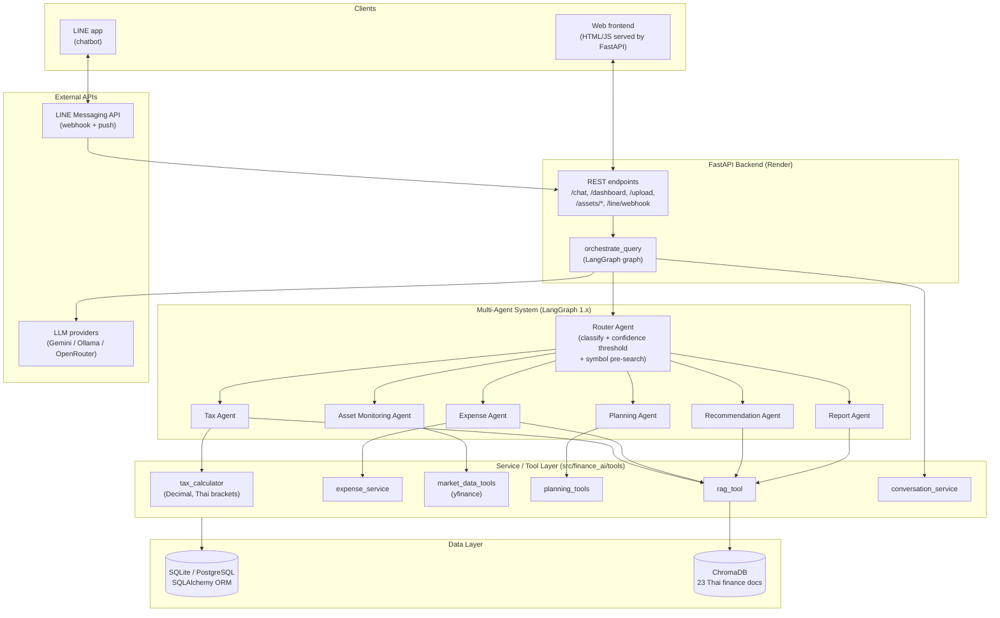
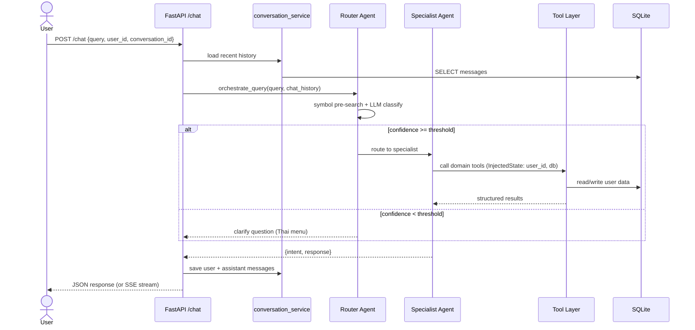
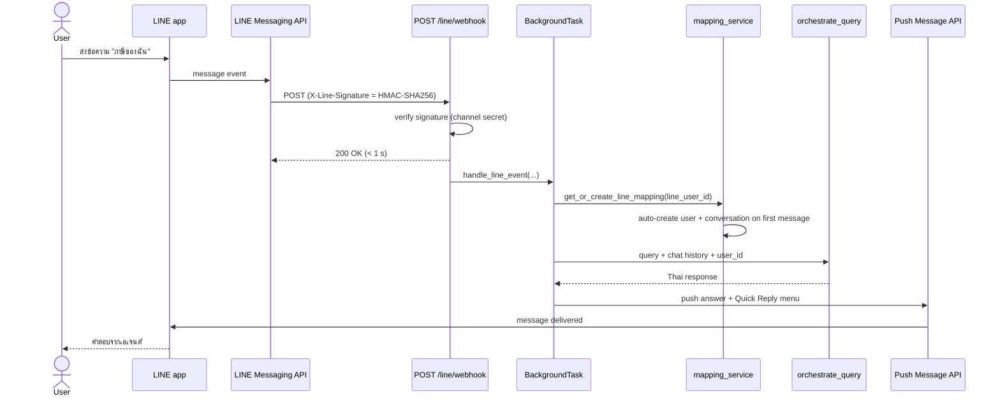
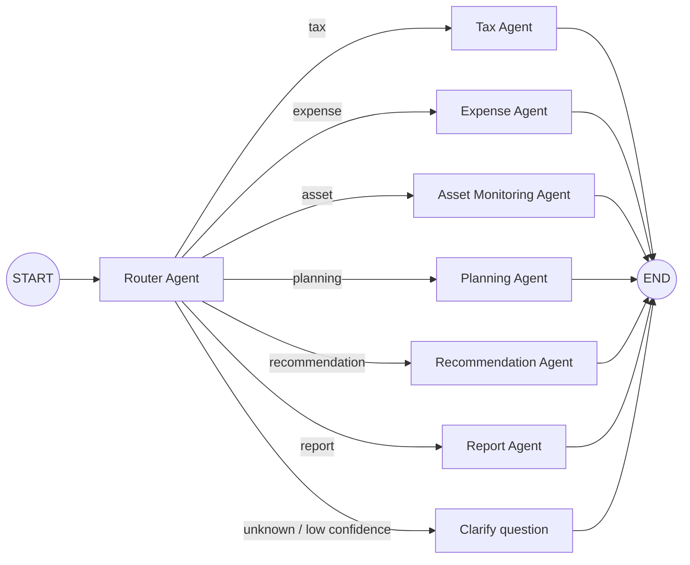
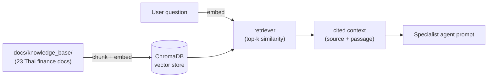
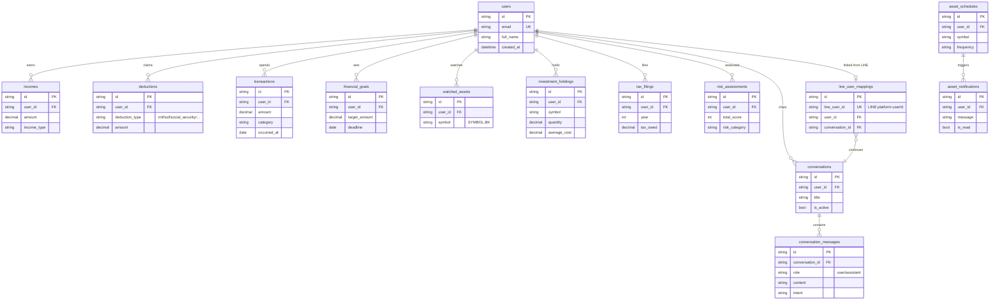
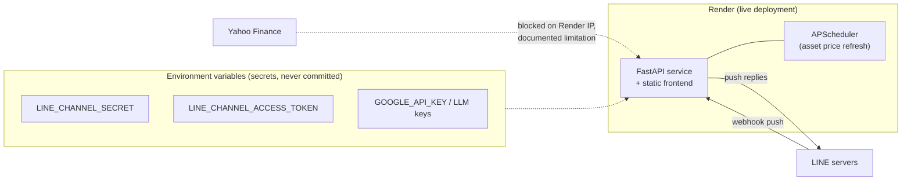

# Architecture & Sequence Diagrams

Diagrams for thesis chapter 3, generated from the actual code
(`src/finance_ai/`). Rendered as Mermaid — GitHub displays them natively.

## 1. System Architecture (Layered View)

## 2. Chat Query Sequence (Web /chat)

## 3. LINE Chatbot Sequence (Push Model)

The webhook answers within LINE's ~1 second window; the agent runs as a
FastAPI background task because slow models (10–30 s on Ollama) outlive
reply tokens (~30 s). Answers are delivered via the Push Message API.

## 4. LangGraph Agent Graph

## 5. RAG Retrieval Flow

## 6. Entity-Relationship Diagram

## 7. Deployment View

